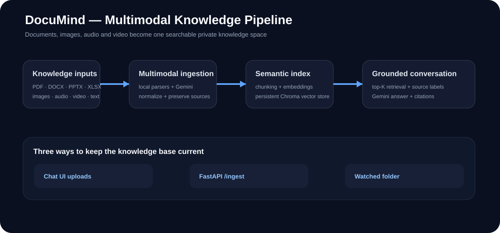

# DocuMind

**DocuMind** is a multimodal knowledge assistant that turns a user-controlled collection of documents, images, audio, video, presentations, spreadsheets and text files into a searchable conversational knowledge base. New files can be added at any time through the application, an ingestion API, a batch folder command, or a watched local folder.

The project grows the multimodal Gemini and multimodal-RAG concepts from the supplied research notebook into an end-to-end application with persistent retrieval, source-aware answers, incremental ingestion, API/UI separation, tests, Docker and CI.



## What DocuMind does

- accepts mixed file collections instead of one document format
- understands images, audio and video in addition to conventional text documents
- extracts page/slide/sheet-aware content where possible
- creates a persistent semantic index that survives application restarts
- lets new files be indexed without rebuilding the whole knowledge base
- retrieves the most relevant source chunks for each question
- generates answers constrained to the retrieved material
- shows the files and source locations used for an answer
- supports a browser chat UI and a REST API
- can automatically index files dropped into a watched folder

## Technology stack

| Layer | Technology | Responsibility |
|---|---|---|
| Conversational UI | Streamlit | Chat interface, uploads, source panels |
| API | FastAPI | Ingestion, source listing and question answering |
| Multimodal model | Gemini via Google GenAI SDK | Image/audio/video understanding and grounded response generation |
| Embeddings | Gemini embeddings | Semantic representation for retrieval |
| Vector database | ChromaDB | Persistent local vector search |
| Document parsing | PyMuPDF, python-docx, python-pptx, openpyxl, BeautifulSoup | Local extraction from common office/document formats |
| Incremental updates | Watchdog + ingestion service | Batch, API, UI and watched-folder indexing |
| Engineering | pytest, Docker, GitHub Actions | Testing, reproducibility and CI |

## Architecture

```text
                ┌─────────────────────────────┐
                │  documents / media / files  │
                └──────────────┬──────────────┘
                               │
                 upload API / UI / folder watch
                               │
                               ▼
                   format-aware ingestion
                               │
          ┌────────────────────┼─────────────────────┐
          ▼                    ▼                     ▼
 local text parsers       PDF/Office parsers    Gemini multimodal
                                               image/audio/video
          └────────────────────┼─────────────────────┘
                               ▼
                     normalized content units
                               ▼
                        chunk + embed
                               ▼
                    persistent Chroma index
                               ▼
 user question → embedding → top-K retrieval
                               ▼
                 context + explicit source labels
                               ▼
                    grounded Gemini answer
                               ▼
                  chat UI + source citations
```

Detailed design: [`docs/ARCHITECTURE.md`](docs/ARCHITECTURE.md).

## Supported content

DocuMind currently routes TXT/Markdown/CSV/JSON/HTML/code, PDF, DOCX, PPTX, XLSX, common image types, common audio types and common video types through appropriate parsing or multimodal processing paths. See [`docs/SUPPORTED_FORMATS.md`](docs/SUPPORTED_FORMATS.md).

## Local setup — step by step

The commands below assume Python 3.11 or newer. Run each command from a terminal and wait for it to finish before continuing.

### 1. Clone the repository

```bash
git clone https://github.com/Jashwanth248/DocuMind.git
cd DocuMind
```

Check that you are in the correct folder:

```bash
ls
```

You should see `README.md`, `requirements.txt`, `app/`, `src/`, `docs/` and `tests/`.

### 2. Create a Python virtual environment

macOS/Linux:

```bash
python3 -m venv .venv
source .venv/bin/activate
```

Windows PowerShell:

```powershell
py -m venv .venv
.\.venv\Scripts\Activate.ps1
```

After activation, your terminal normally shows `(.venv)` before the command prompt.

### 3. Install dependencies

```bash
python -m pip install --upgrade pip
pip install -r requirements.txt
```

### 4. Create the local environment file

macOS/Linux:

```bash
cp .env.example .env
```

Windows PowerShell:

```powershell
Copy-Item .env.example .env
```

Open `.env` and add your Gemini API key:

```text
GEMINI_API_KEY=your_real_key_here
```

Never commit `.env`. It is already excluded by `.gitignore`.

### 5. Start the API

Open Terminal 1 inside the project folder, activate `.venv`, then run:

```bash
uvicorn app.api:app --reload --port 8000
```

Useful URLs:
- API health: `http://localhost:8000/health`
- API documentation: `http://localhost:8000/docs`

Leave this terminal running.

### 6. Start the chat interface

Open Terminal 2, enter the same project folder, activate `.venv`, then run:

```bash
streamlit run app/ui.py
```

Your browser should open at `http://localhost:8501`.

### 7. Add knowledge

In the left sidebar:
1. choose one or more files;
2. select **Index selected files**;
3. wait for each file to show as indexed;
4. ask a question in the chat box.

The source drawer under an answer shows which indexed files were retrieved.

### 8. Add an entire folder instead of using the UI

```bash
python scripts/index_folder.py /path/to/your/folder
```

Example:

```bash
python scripts/index_folder.py data/uploads
```

### 9. Automatically index newly dropped files

```bash
python scripts/watch_folder.py data/uploads
```

Keep that process running. A new file copied into `data/uploads/` will be sent through the same ingestion pipeline.

### 10. Run the tests

```bash
pytest -q
```

### 11. Stop the application

Press `Ctrl+C` in the Streamlit terminal and again in the FastAPI terminal.

## Docker

After creating `.env`:

```bash
docker compose up --build
```

Then use:
- Chat UI: `http://localhost:8501`
- API: `http://localhost:8000`
- API docs: `http://localhost:8000/docs`

## Example workflow

```text
Upload product manual.pdf
Upload meeting-recording.mp3
Upload whiteboard.jpg
Upload demo-video.mp4
              ↓
DocuMind indexes the material
              ↓
Ask: "What decisions were made about the product launch, and where are they documented?"
              ↓
Retrieval finds the relevant PDF page, audio summary and image/video metadata
              ↓
DocuMind answers from those sources and lists the retrieved evidence
```

## Project boundaries

The checked-in application is designed as a strong local implementation. A production multi-user deployment would add authentication/authorization, object storage, managed vector infrastructure, background job queues for large media, audit logs, malware scanning, encryption/KMS, rate limiting and tenant isolation. These are documented as production extensions instead of being hidden behind demo code.

## Documentation

- [`docs/ARCHITECTURE.md`](docs/ARCHITECTURE.md) — system boundaries and design decisions
- [`docs/DATA_FLOW.md`](docs/DATA_FLOW.md) — ingestion through answer generation
- [`docs/SUPPORTED_FORMATS.md`](docs/SUPPORTED_FORMATS.md) — file routing and processing
- [`docs/SECURITY.md`](docs/SECURITY.md) — privacy/security considerations
- [`docs/EVALUATION.md`](docs/EVALUATION.md) — retrieval and grounded-answer evaluation plan

## Source-material note

The supplied notebook demonstrates Gemini multimodal prompts and a multimodal RAG workflow using extracted text/image metadata, similarity retrieval and context-grounded generation. DocuMind uses those concepts as a foundation but reorganizes them into an original maintainable application instead of presenting lab notebook code as production code.
